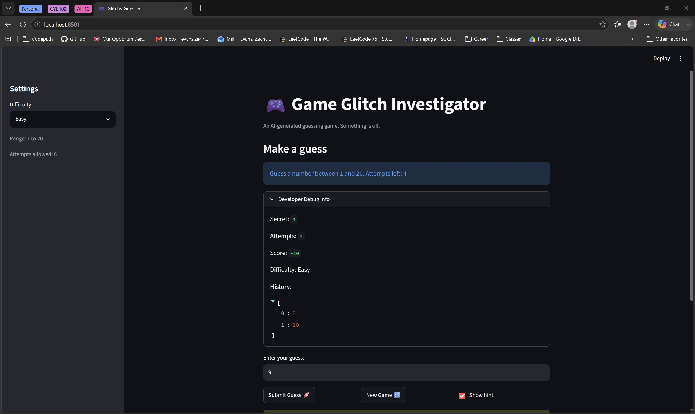
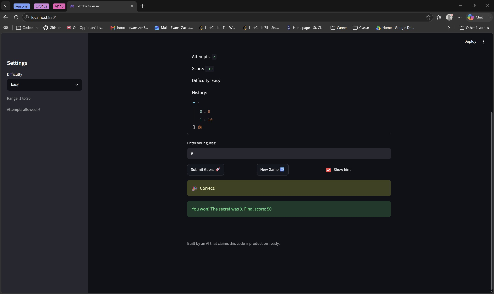

# 🎮 Game Glitch Investigator: The Impossible Guesser

## 🚨 The Situation

You asked an AI to build a simple "Number Guessing Game" using Streamlit.
It wrote the code, ran away, and now the game is unplayable. 

- You can't win.
- The hints lie to you.
- The secret number seems to have commitment issues.

## 🛠️ Setup

1. Install dependencies: `pip install -r requirements.txt`
2. Run the broken app: `python -m streamlit run app.py`

## 🕵️‍♂️ Your Mission

1. **Play the game.** Open the "Developer Debug Info" tab in the app to see the secret number. Try to win.
2. **Find the State Bug.** Why does the secret number change every time you click "Submit"? Ask ChatGPT: *"How do I keep a variable from resetting in Streamlit when I click a button?"*
3. **Fix the Logic.** The hints ("Higher/Lower") are wrong. Fix them.
4. **Refactor & Test.** - Move the logic into `logic_utils.py`.
   - Run `pytest` in your terminal.
   - Keep fixing until all tests pass!

## 📝 Document Your Experience

- [✔️] Describe the game's purpose.

The game's purpose is to provide a secret number guessing game with three difficulties, it chooses a secret number randomly from a given range based and gives a set amount of attempts both based on difficulty. The user then will guess numbers using the games hints of too high, or too low to try and guess the secret number.

- [✔️] Detail which bugs you found.

The first bug I found is that the game would tell you to go the wrong direction when you made a wrong guess.

The second bug I found was that every even guess would be converted from an interger to a string, causing the guess not to be parsed correctly.

The third bug I found was that if an even guess was too high, it would give the user 5 points instead of taking 5 points away.

- [✔️] Explain what fixes you applied.

To fix the first bug, I switched around the messages, so it told you to go lower if your guess was to high and to go higher if your guess was too low.

To fix the second bug, I just removed if statement that converted every even guess to a string.

To fix the third bug, I did the same thing and just removed the if statement that made it so every even guess would give five points if the guess was too high.

## 📸 Demo Walkthrough

Describe your fixed game in numbered steps so a reader can follow along without watching a video:

1. User selects a difficulty from menu in sidebar.
2. Game gets a random secret number from the range of the selected difficulty.
3. User guesses a number.
4. Game returns  "📉 Go LOWER!", "📈 Go HIGHER!", or  "🎉 Correct!" based on the users guess compared to the secret number.
5. Game updates score after every guess.
6. If the user gets the correct guess and the "🎉 Correct!" message shows, the game ends.

**Screenshot** *(optional)*:

### Screenshot 1



### Screenshot 2



## 🧪 Test Results

```
(.venv) PS C:\Users\evans\Desktop\CodePath AI110\ai110-module1show-gameglitchinvestigator-starter> python -m pytest
============================================================================================ test session starts =============================================================================================
platform win32 -- Python 3.13.13, pytest-9.0.3, pluggy-1.6.0
rootdir: C:\Users\evans\Desktop\CodePath AI110\ai110-module1show-gameglitchinvestigator-starter
plugins: anyio-4.13.0
collected 10 items                                                                                                                                                                                            

tests\test_game_logic.py ..........                                                                                                                                                                     [100%]

============================================================================================= 10 passed in 0.06s =============================================================================================
```

## 🚀 Stretch Features

- [ ] [If you choose to complete Challenge 4, describe the Enhanced UI changes here — a screenshot is optional]
